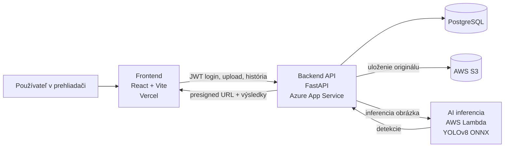

# PotholeAI

Webová aplikácia na detekciu dier na cestách z fotografie pomocou AI modelu YOLOv8. Používateľ sa prihlási, nahrá snímku vozovky, doplní metadáta, backend odošle obrázok na inferenciu do AWS Lambda, výsledné detekcie uloží do PostgreSQL a zobrazí ich vo forme anotovaného obrázka, histórie a mapy.

Tento dokument slúži ako centralizovaný prehľad projektu. Nahrádza roztrúsené základné informácie z podpriečinkov a je napísaný tak, aby zároveň pokrýval dokumentačné požiadavky zo zadania.

## 1. Zadanie a cieľ riešenia

Zadanie vyžaduje vytvoriť cloudovú webovú alebo mobilnú aplikáciu s:

- frontendom a backendom,
- databázou,
- nasadením v cloude,
- aspoň jednou ďalšou cloudovou službou od iného providera než je hosting hlavnej aplikácie,
- využitím AI alebo IoT,
- dokumentáciou architektúry, technológií, použitia a tímového príspevku.

Navrhované riešenie tieto body spĺňa nasledovne:

| Požiadavka | Riešenie v projekte |
|---|---|
| Frontend | React + Vite aplikácia v priečinku `frontend/` |
| Backend | FastAPI aplikácia v priečinku `backend/` |
| Databáza | PostgreSQL, schéma v `backend/db/schema.sql` |
| Extra cloud služba od iného providera | AWS S3 a AWS Lambda |
| AI prvok | YOLOv8 model exportovaný do ONNX a spúšťaný v Lambda image |
| Cloud hosting | Odporúčané nasadenie: frontend na Vercel, backend na Azure App Service, AI a úložisko na AWS |

Projekt teda kombinuje viacero cloudových služieb a providerov:

- `Vercel` pre frontend,
- `Azure App Service` pre backend,
- `PostgreSQL` ako perzistentné úložisko,
- `AWS S3` pre uloženie obrázkov,
- `AWS Lambda` pre AI inferenciu.

To znamená, že požiadavka na využitie služby od iného providera než je hosting backendu/frontendu je splnená cez AWS komponenty.

## 2. Stručný popis aplikácie

Používateľ nahrá fotografiu cesty a doplní základné údaje, napríklad lokalitu, dátum a typ cesty. Backend:

1. overí JWT token používateľa,
2. skontroluje typ a veľkosť obrázka,
3. uloží originál obrázka do AWS S3,
4. zavolá AWS Lambda funkciu s AI modelom,
5. spracuje detekcie dier,
6. uloží výsledky aj metadáta do PostgreSQL,
7. vráti výsledok frontendu.

Frontend následne zobrazí:

- anotovaný obrázok s ohraničujúcimi rámikmi,
- zoznam detekovaných dier,
- históriu analýz,
- mapu s vizualizáciou výskytu podľa lokality a závažnosti.

## 3. Funkcionalita projektu

Aktuálne implementované alebo navrhnuté časti:

| Časť | Stav | Poznámka |
|---|---|---|
| Frontend nahrávania a výsledkov | hotové | nahratie obrázka, výsledky, štatistiky |
| Prihlásenie používateľa | hotové | `POST /login`, JWT token |
| História analýz | hotové | `GET /history`, `GET /history/{analysis_id}` |
| Mapa výskytu dier | hotové | React Leaflet + OpenStreetMap |
| Backend detekcia | hotové | `POST /detect` |
| PostgreSQL schéma | hotové | tabuľky `users`, `analyses`, `detections` |
| Ukladanie obrázkov do S3 | hotové | privátny bucket + presigned URL |
| AI inferencia v AWS Lambda | hotové/návrh pripravený | ONNX model v container image |
| Docker Compose pre celý stack | čiastočne pripravené | compose súbor je zatiaľ len s čiastočne zakomentovanými službami |

Poznámka: niektoré staršie README súbory v podpriečinkoch ešte popisujú starší flow. Aktuálny zdroj pravdy pre správanie aplikácie je implementácia v kóde a tento koreňový `README`.

## 4. Architektúra a prepojenie služieb



### Tok spracovania jedného obrázka

1. Používateľ sa prihlási cez `POST /login`.
2. Frontend pošle obrázok a metadáta na `POST /detect`.
3. Backend validuje vstup a uloží obrázok do `AWS S3`.
4. Backend zavolá `AWS Lambda`, ktorá načíta alebo spracuje obrázok a vráti detekcie.
5. Backend dopočíta súhrn, uloží výsledky do `PostgreSQL` a vráti odpoveď frontendu.
6. Frontend zobrazí anotovaný obrázok, zoznam detekcií a umožní neskoršie zobrazenie z histórie alebo mapy.

## 5. Odôvodnenie zvolených technológií

### Frontend

- `React 18` je vhodný na interaktívne SPA rozhranie.
- `Vite` zrýchľuje lokálny vývoj a proces vytvorenia buildu.
- `React Leaflet` a `OpenStreetMap` umožňujú bezplatnú mapovú vizualizáciu bez viazanosti na proprietárny mapový provider.

### Backend

- `FastAPI` poskytuje rýchle REST API, validáciu vstupov a jednoduchú prácu s JSON a multipart uploadom.
- `PyJWT` a `bcrypt` riešia autentifikáciu používateľov cez JWT tokeny a hashovanie hesiel.
- `slowapi` pridáva rate limiting pre základnú ochranu endpointov.

### Databáza

- `PostgreSQL` je vhodná relačná databáza pre používateľov, analýzy aj jednotlivé detekcie.
- Schéma umožňuje ukladať metadáta, agregované štatistiky aj detailné ohraničujúce rámiky.

### Cloud a AI

- `AWS S3` je vhodné objektové úložisko pre obrázky.
- `AWS Lambda` umožňuje oddeliť AI inferenciu od hlavného backendu.
- `YOLOv8 -> ONNX` znižuje záťaž oproti plnému PyTorch runtime a lepšie sa hodí do serverless prostredia.
- `Azure App Service` je vhodné PaaS riešenie pre backend bez potreby správy VM.
- `Vercel` je jednoduchý hosting pre frontend postavený na statickom build-e.

## 6. Štruktúra repozitára

```text
CT-Zadanie2-frontend-auth/
├── README.md
├── docker-compose.yml
├── frontend/
│   ├── src/
│   │   ├── components/
│   │   ├── hooks/
│   │   ├── services/api.js
│   │   └── constants/
│   ├── .env.example
│   └── Dockerfile
├── backend/
│   ├── app/
│   │   ├── routes/
│   │   ├── services/
│   │   ├── auth.py
│   │   ├── config.py
│   │   └── main.py
│   ├── db/
│   │   ├── schema.sql
│   │   └── README.md
│   ├── scripts/
│   ├── storage/s3/
│   ├── .env.example
│   ├── requirements.txt
│   └── Dockerfile
├── lambda/
│   ├── Dockerfile
│   └── export_onnx.py
└── ml/
    └── backend_conversion_example.py
```

## 7. Backend API

Aktuálne endpointy podľa implementácie:

| Metóda | Endpoint | Popis |
|---|---|---|
| `POST` | `/login` | Prihlásenie používateľa a vydanie JWT tokenu |
| `POST` | `/detect` | Nahratie obrázka, AI inferencia, uloženie výsledku a návrat odpovede |
| `GET` | `/history` | Zoznam analýz používateľa s filtrami |
| `GET` | `/history/{analysis_id}` | Detail jednej uloženej analýzy |
| `GET` | `/health` | Endpoint kontroly stavu |

### Formát detekcie

Backend vracia detekcie vo formáte očakávanom frontendom:

```json
{
  "analysisId": "uuid",
  "imageUrl": "presigned-url",
  "detections": [
    {
      "id": 1,
      "x": 0.091,
      "y": 0.317,
      "w": 0.138,
      "h": 0.054,
      "confidence": 0.91,
      "severity": "low"
    }
  ],
  "summary": {
    "count": 1,
    "maxSeverity": "low",
    "avgConfidence": 0.91
  }
}
```

Súradnice `x`, `y`, `w`, `h` sú normalizované na interval `0.0 - 1.0` vzhľadom na rozmery obrázka.

## 8. Dáta, databáza a úložisko

Databáza obsahuje tri hlavné entity:

- `users` pre autentifikáciu používateľov,
- `analyses` pre jednu analýzu obrázka a jej metadáta,
- `detections` pre jednotlivé detegované diery.

Do PostgreSQL sa ukladajú:

- identita používateľa,
- textová lokalita a voliteľne GPS súradnice,
- dátum zachytenia,
- typ cesty,
- názov súboru, content type a veľkosť obrázka,
- počet detekcií, maximálna závažnosť, priemerná confidence,
- detailné ohraničujúce rámiky.

Do `AWS S3` sa ukladajú originálne obrázky. Databáza si drží len objektový kľúč a backend generuje krátkodobé `presigned URL` pre zobrazenie v klientovi.

Odporúčaný formát objektového kľúča:

```text
uploads/originals/YYYY/MM/{analysis_id}.{ext}
```

## 9. Lokálne spustenie

### Predpoklady

- `Node.js` a `npm`
- `Python 3`
- `PostgreSQL`
- AWS účet s `S3` bucketom a `Lambda` funkciou, ak chcete testovať plný cloud flow

### Frontend

```powershell
cd frontend
copy .env.example .env
npm install
npm run dev
```

Predvolená lokálna adresa je typicky `http://localhost:5173` alebo podľa Vite výpisu.

### Backend

```powershell
copy backend\.env.example backend\.env
py -3 -m venv .venv
.venv\Scripts\activate
pip install -r backend\requirements.txt
uvicorn backend.app.main:app --reload
```

Backend štandardne beží na `http://localhost:8000`.

### Dôležité backend premenné

Súbor `backend/.env` musí obsahovať najmä:

- `DATABASE_URL`
- `JWT_SECRET`
- `CORS_ORIGINS`
- `MAX_UPLOAD_BYTES`
- `AWS_ACCESS_KEY_ID`
- `AWS_SECRET_ACCESS_KEY`
- `AWS_REGION`
- `S3_BUCKET`
- `S3_PRESIGN_SECONDS`
- `LAMBDA_FUNCTION_NAME`

Ak je `RUN_MIGRATIONS_ON_STARTUP=true`, backend pri štarte aplikuje databázovú schému a migrácie automaticky.

### Poznámka k lokálnemu loginu

Endpoint `POST /login` očakáva existujúceho používateľa v tabuľke `users`. Pre lokálne testovanie je teda potrebné mať v databáze vytvorený testovací účet.

## 10. Lambda a AI model

Priečinok `lambda/` obsahuje prípravu AI inferencie ako AWS Lambda container image.

Základný postup:

```powershell
python lambda\export_onnx.py
docker build -f lambda/Dockerfile -t pothole-lambda .
docker run --rm -p 9000:8080 pothole-lambda
```

Model:

- vychádza z `YOLOv8`,
- je exportovaný do `ONNX`,
- beží cez `onnxruntime`,
- vracia detekcie kompatibilné s frontendom.

## 11. Vstupy a výstupy aplikácie

### Vstupy

- prihlasovacie údaje používateľa,
- obrázok vozovky vo formáte `JPEG`, `PNG` alebo `WebP`,
- metadáta:
  - lokalita,
  - dátum,
  - typ cesty.

### Výstupy

- anotovaný obrázok s vyznačenými dierami,
- zoznam detekcií s confidence a severity,
- sumár analýzy,
- história predchádzajúcich analýz,
- mapová vizualizácia lokalít.

## 12. Nasadenie do cloudu

Odporúčaná finálna architektúra pre odovzdanie:

| Komponent | Odporúčaný provider | Poznámka |
|---|---|---|
| Frontend | Vercel | jednoduché nasadenie Vite buildu |
| Backend | Azure App Service | PaaS hosting REST API |
| Databáza | Azure Database for PostgreSQL alebo Render Postgres | relačné dáta aplikácie |
| Storage | AWS S3 | obrázky |
| AI inferencia | AWS Lambda | serverless AI spracovanie |

Takéto rozdelenie pekne demonštruje multi-cloud prístup a zároveň spĺňa podmienku využitia služby od iného providera.

## 13. Tímový príspevok

Túto sekciu odporúčam doplniť pred odovzdaním podľa reálnych členov tímu a commit histórie.

| Člen tímu | Zodpovednosť | Konkrétny príspevok |
|---|---|---|
| Meno 1 | Frontend / team lead | UI, upload flow, výsledky, koordinácia |
| Meno 2 | Backend a databáza | FastAPI API, auth, PostgreSQL schéma |
| Meno 3 | ML a cloud | YOLOv8, ONNX export, AWS Lambda, S3 |

K tejto tabuľke je vhodné priradiť aj konkrétne issue, tasky alebo vetvy, aby bola aktívna účasť ľahko dohľadateľná v Git histórii.

## 14. Ďalšia dokumentácia

Podrobnejšie technické poznámky ostávajú aj v podpriečinkoch:

- `backend/db/README.md`
- `backend/storage/s3/README.md`

Základný vstupný dokument pre projekt je odteraz tento koreňový `README.md`.
