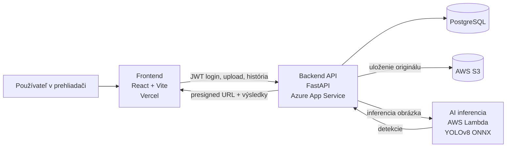

# CT-Zadanie2

Webová aplikácia na detekciu dier na cestách z fotografie pomocou AI modelu YOLOv8. Používateľ nahrá snímku vozovky, doplní metadáta a aplikácia mu zobrazí výsledok vo forme anotovaného obrázka, histórie analýz a mapy.

## 1. Zadanie a cieľ riešenia

Cieľom projektu bolo vytvoriť cloudovú webovú aplikáciu, ktorá obsahuje frontend, backend, databázu a jednu ďalšiu cloudovú službu od iného providera. Súčasťou riešenia malo byť aj využitie AI alebo IoT a dokumentácia architektúry, použitých služieb a tímového príspevku.

V projekte sme tieto požiadavky pokryli takto:

| Požiadavka | Riešenie v projekte |
|---|---|
| Frontend | React + Vite aplikácia v priečinku `frontend/` |
| Backend | FastAPI aplikácia v priečinku `backend/app` |
| Databáza | PostgreSQL, schéma v `backend/db/schema.sql` |
| Extra cloud služba od iného providera | AWS S3 a AWS Lambda |
| AI prvok | YOLOv8 model exportovaný do ONNX a spúšťaný v Lambda image |
| Cloud hosting | frontend na Vercel, backend na Azure App Service, AI a object storage na AWS |

## 2. Stručný popis aplikácie

Používateľ nahrá fotografiu cesty a doplní základné údaje, napríklad lokalitu, dátum a typ cesty.

Backend:
1. overí JWT token používateľa,
2. skontroluje typ a veľkosť obrázka,
3. uloží originál obrázka do AWS S3,
4. zavolá AWS Lambda funkciu s AI modelom,
5. spracuje detekcie dier,
6. uloží výsledky aj metadáta do PostgreSQL,
7. vráti výsledok frontendu.

Frontend následne zobrazí:

- anotovaný obrázok s ohraničujúcimi rámikmi,
- zoznam detekovaných dier,
- históriu analýz,
- mapu s vizualizáciou výskytu podľa lokality a závažnosti.

## 3. Ako používať aplikáciu

1. Používateľ sa prihlási pomocou vytvoreného účtu.
2. V časti pre nahratie obrázka vyberie fotografiu vozovky.
3. Doplní metadáta, hlavne lokalitu, dátum a typ cesty.
4. Po odoslaní aplikácia spustí detekciu a zobrazí výsledky.
5. Staršie analýzy sa dajú pozrieť v histórii alebo na mape.

## 4. Funkcionalita projektu

Aktuálne implementované časti:

| Časť | Poznámka |
|---|---|
| Frontend nahrávania a výsledkov | nahratie obrázka, výsledky, štatistiky |
| Prihlásenie používateľa | `POST /login`, JWT token |
| História analýz | `GET /history`, `GET /history/{analysis_id}` |
| Mapa výskytu dier | React Leaflet + OpenStreetMap |
| Backend detekcia | `POST /detect` |
| PostgreSQL schéma | tabuľky `users`, `analyses`, `detections` |
| Ukladanie obrázkov do S3 | privátny bucket + presigned URL |
| AI inferencia v AWS Lambda | ONNX model v container image |

## 5. Architektúra a prepojenie služieb



### Tok spracovania jedného obrázka

1. Používateľ sa prihlási cez `POST /login`.
2. Frontend pošle obrázok a metadáta na `POST /detect`.
3. Backend validuje vstup a uloží obrázok do `AWS S3`.
4. Backend zavolá `AWS Lambda`, ktorá spracuje obrázok a vráti detekcie.
5. Backend dopočíta súhrn, uloží výsledky do `PostgreSQL` a vráti odpoveď frontendu.
6. Frontend zobrazí anotovaný obrázok, zoznam detekcií a umožní neskoršie zobrazenie z histórie alebo mapy.

## 6. Štruktúra repozitára

```text
CT-Zadanie2/
├── frontend/              # React + Vite klientská aplikácia
├── backend/               # FastAPI backend, routes, služby a konfigurácia
├── backend/db/            # PostgreSQL schéma a databázové súbory
├── backend/storage/s3/    # práca s AWS S3 a presigned URL
├── lambda/                # AWS Lambda container pre AI inferenciu
├── ml/                    # tréning, export a pomocné ML skripty
├── docker-compose.yml     # lokálne spustenie vybraných služieb
└── README.md              # hlavná dokumentácia projektu
```

## 7. Backend API

Aktuálne endpointy podľa implementácie:

| Metóda | Endpoint | Popis |
|---|---|---|
| `POST` | `/login` | Prihlásenie používateľa a vydanie JWT tokenu |
| `POST` | `/detect` | Nahratie obrázka, AI inferencia, uloženie výsledku a návrat odpovede |
| `GET` | `/history` | Zoznam analýz používateľa s filtrami |
| `GET` | `/history/{analysis_id}` | Detail jednej uloženej analýzy |
| `GET` | `/health` | Endpoint kontroly stavu |

### Formát detekcie

Backend vracia detekcie vo formáte očakávanom frontendom:

```json
{
  "analysisId": "uuid",
  "imageUrl": "presigned-url",
  "detections": [
    {
      "id": 1,
      "x": 0.091,
      "y": 0.317,
      "w": 0.138,
      "h": 0.054,
      "confidence": 0.91,
      "severity": "low"
    }
  ],
  "summary": {
    "count": 1,
    "maxSeverity": "low",
    "avgConfidence": 0.91
  }
}
```

Súradnice `x`, `y`, `w`, `h` sú normalizované na interval `0.0 - 1.0` vzhľadom na rozmery obrázka.

## 8. Dáta, databáza a úložisko

Databáza obsahuje tri hlavné entity:

- `users` pre autentifikáciu používateľov,
- `analyses` pre jednu analýzu obrázka a jej metadáta,
- `detections` pre jednotlivé detegované diery.

Do PostgreSQL sa ukladajú:

- identita používateľa,
- textová lokalita a voliteľne GPS súradnice,
- dátum zachytenia,
- typ cesty,
- názov súboru, content type a veľkosť obrázka,
- počet detekcií, maximálna závažnosť, priemerná confidence,
- detailné ohraničujúce rámiky.

Do `AWS S3` sa ukladajú originálne obrázky. Databáza si drží len objektový kľúč a backend generuje krátkodobé `presigned URL` pre zobrazenie v klientovi.

## 9. Lokálne spustenie

### Predpoklady

- `Node.js` a `npm`
- `Python 3`
- `PostgreSQL`
- AWS účet s `S3` bucketom a `Lambda` funkciou, ak chcete testovať plný cloud flow

### Frontend

```powershell
cd frontend
copy .env.example .env
npm install
npm run dev
```

Predvolená lokálna adresa je `http://localhost:5173` alebo podľa Vite výpisu.

### Backend

```powershell
copy backend\.env.example backend\.env
py -3 -m venv .venv
.venv\Scripts\activate
pip install -r backend\requirements.txt
uvicorn backend.app.main:app --reload
```

Backend štandardne beží na `http://localhost:8000`.

### Dôležité backend premenné

Súbor `backend/.env` musí obsahovať najmä:

- `DATABASE_URL`
- `JWT_SECRET`
- `CORS_ORIGINS`
- `MAX_UPLOAD_BYTES`
- `AWS_ACCESS_KEY_ID`
- `AWS_SECRET_ACCESS_KEY`
- `AWS_REGION`
- `S3_BUCKET`
- `S3_PRESIGN_SECONDS`
- `LAMBDA_FUNCTION_NAME`

Ak je `RUN_MIGRATIONS_ON_STARTUP=true`, backend pri štarte aplikuje databázovú schému a migrácie automaticky.

### Poznámka k lokálnemu loginu

Endpoint `POST /login` očakáva existujúceho používateľa v tabuľke `users`. Pre lokálne testovanie je teda potrebné mať v databáze vytvorený testovací účet.

## 10. Lambda a AI model

Priečinok `lambda/` obsahuje prípravu AI inferencie ako AWS Lambda container image.

Základný postup:

```powershell
python lambda\export_onnx.py
docker build -f lambda/Dockerfile -t pothole-lambda .
docker run --rm -p 9000:8080 pothole-lambda
```


## 11. Nasadenie do cloudu

| Komponent | Služba | Účel |
|---|---|---|
| Frontend | Vercel | hosting React/Vite aplikácie |
| Backend | Azure App Service | FastAPI REST API |
| Databáza | Render PostgreSQL | relačné dáta aplikácie |
| Storage | AWS S3 | uloženie originálnych obrázkov |
| AI inferencia | AWS Lambda | serverless spracovanie obrázka modelom |

## 12. Tímový príspevok

| Člen tímu | Zodpovednosť | Konkrétny príspevok |
|---|---|---|
| Kristína Gvozdiaková | Frontend | UI, upload flow |
| Peter Zeleňák | Backend a databáza | FastAPI, auth, PostgreSQL schéma |
| Michal Hajdu | ML, Cloud - Team lead | YOLOv8, ONNX export, AWS Lambda, S3 |
